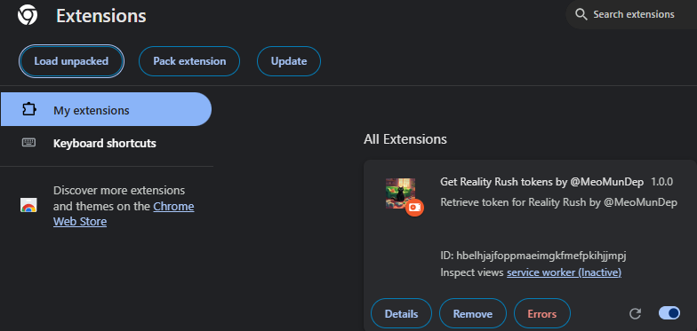

# Your Extension Name

A brief description of your extension and its main features.

## Installation

### Step 1: Download the Source Code

1. Download the Extension files.
2. Extract the files.

### Step 2: Open Chrome

1. Launch the Google Chrome browser.

### Step 3: Access the Extensions Page

1. Click on the three dots in the upper right corner of the browser.
2. Select **"More tools"** > **"Extensions"**.
3. Alternatively, you can enter `chrome://extensions/` in the address bar and press Enter.

### Step 4: Enable Developer Mode

1. In the top right corner of the **Extensions** page, toggle the **"Developer mode"** switch on.

### Step 5: Load the Extension

1. Click on the **"Load unpacked"** button.
2. Select the folder containing the extension.

### Step 6: Verify the Extension

1. After loading, you should see your extension listed among the installed extensions.
2. Click on the extension's icon to start using it.

## Usage

